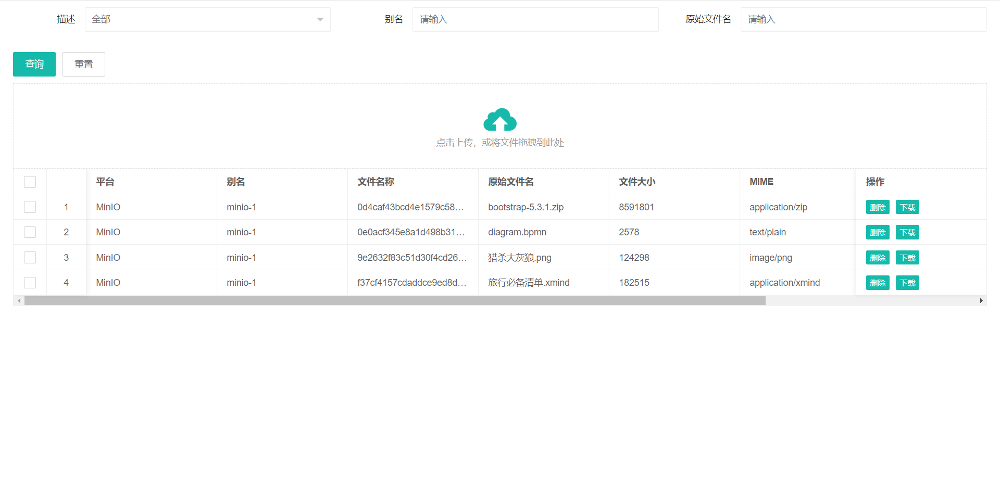

# file-storage-spring-boot-starter

[](https://jitpack.io/#com.gitee.wb04307201/file-storage-spring-boot-starter)

> 一个适配多平台文件存储的工具包  
> 可通过简单的配置既可集成到springboot中  
> 将文件存储到本地、MinIO、华为云OBS、百度云 BOS、阿里云OSS、腾讯云COS、WebDAV、Git等平台  

## [代码示例](https://gitee.com/wb04307201/file-storage-demo)

## 第一步 增加 JitPack 仓库

```xml

<repositories>
    <repository>
        <id>jitpack.io</id>
        <url>https://jitpack.io</url>
    </repository>
</repositories>
```

## 第二步 引入jar

版本请到[jitpack](https://jitpack.io/#com.gitee.wb04307201/chatbot-spring-boot-starter)查看

```xml

<dependency>
    <groupId>com.gitee.wb04307201</groupId>
    <artifactId>file-storage-spring-boot-starter</artifactId>
    <version>版本</version>
</dependency>
```

## 第三步 在启动类上加上`@EnableFileStorage`注解

```java
@EnableFileStorage
@SpringBootApplication
public class FileStorageDemoApplication {

    public static void main(String[] args) {
        SpringApplication.run(FileStorageDemoApplication.class, args);
    }

}
```

## 第四步 `application.yml`配置文件中添加以下相关配置，可以配置多个存储

```yaml
file:
  storage: #文件存储配置，不使用的情况下可以不写
    local: # 本地存储
      - enable-storage: true  #启用存储
        base-path: local/ # 基础路径
        storage-path: D:/Temp/ # 存储路径
        alias: local-1 # 别名
    minIO: # MinIO
      - enable-storage: true  # 启用存储
        access-key: ??
        secret-key: ??
        end-point: ??
        bucket-name: ??
        base-path: temp/ # 基础路径
        alias: minio-1 # 别名
    huaweiOBS: #HuaweiOBS
      - enable-storage: true  # 启用存储
        access-key: ??
        secret-key: ??
        end-point: ??
        bucket-name: ??
        base-path: temp/ # 基础路径
        alias: huaweiOBS-1 # 别名
    baiduBOS: #BaiduBOS
      - enable-storage: true  # 启用存储
        access-key: ??
        secret-key: ??
        end-point: ??
        bucket-name: ??
        base-path: temp/ # 基础路径
        alias: baiduBOS-1 # 别名
    aliyunOSS: #AliyunOSS
      - enable-storage: true  # 启用存储
        access-key: ??
        secret-key: ??
        end-point: ??
        bucket-name: ??
        base-path: temp/ # 基础路径
        alias: aliyunOSS-1 # 别名
    tencentCOS: #TencentCOS
      - enable-storage: true  # 启用存储
        secret-id: ??
        secret-key: ??
        end-point: ??
        bucket-name: ??
        base-path: temp/ # 基础路径
        alias: tencentCOS-1 # 别名
    webDAV: #WebDAV
      - enable-storage: true  #启用存储
        base-path: temp/ # 基础路径
        storage-path: /aliyun/ # 存储路径
        server: http://127.0.0.1:5244 # Git仓库地址
        user: admin # 用户名
        password: q54U4YJb # 密码
        alias: webDAV-1 # 别名
    git: #Git
      - enable-storage: true  #启用存储
        base-path: git/ # 基础路径
        storage-path: D:/GitTemp/ # 存储路径,会将仓库clone到这个目录
        repo: https://gitee.com/??/?? # Git仓库地址
        username: ?? # 用户名
        password: ?? # 密码
        alias: git-1 # 别名
```

## 第五步 注入FileStorageServiceb并调用文件存储功能

```yaml
@Controller
public class PageController {

    @Autowired
    FileStorageService fileStorageService;

    @Autowired
    IFileStroageRecord fileStroageRecord;

    /** 测试用平台别名 **/
    private String alias = "local-1";
    //private String alias = "minio-1";
    //private String alias = "webDAV-1";
    //private String alias = "git-1";

    /**
     * 查询显示列表
     * @param model
     * @param fileInfo
     * @return
     */
    @PostMapping(value = "/list")
    public String upload(Model model, FileInfo fileInfo) {
        model.addAttribute("list", fileStroageRecord.list(fileInfo));
        model.addAttribute("query", fileInfo);
        return "list";
    }

    /**
     * 上传文件
     * @param file
     * @param model
     * @return
     */
    @PostMapping(value = "/upload")
    public String upload(MultipartFile file, Model model) {
        fileStorageService.save(new MultipartFileStorage(file).setAlias(alias).setPath("ttt"));
        FileInfo fileInfo = new FileInfo();
        model.addAttribute("list", fileStroageRecord.list(fileInfo));
        model.addAttribute("query", fileInfo);
        return "list";
    }

    /**
     * 显示列表
     * @param model
     * @return
     */
    @GetMapping(value = "/list")
    public String upload(Model model) {
        FileInfo fileInfo = new FileInfo();
        model.addAttribute("list", fileStroageRecord.list(fileInfo));
        model.addAttribute("query", fileInfo);
        return "list";
    }

    /**
     * 删除文件
     * @param req
     * @param model
     * @return
     */
    @GetMapping(value = "/delete")
    public String delete(HttpServletRequest req, Model model) {
        String id = req.getParameter("id");
        fileStorageService.delete(id);
        FileInfo fileInfo = new FileInfo();
        model.addAttribute("list", fileStroageRecord.list(fileInfo));
        model.addAttribute("query", fileInfo);
        return "list";
    }

    /**
     * 下载文件
     * @param req
     * @param resp
     */
    @GetMapping(value = "/download")
    public void download(HttpServletRequest req, HttpServletResponse resp) {
        String id = req.getParameter("id");
        MultipartFileStorage file = fileStorageService.download(id);
        resp.reset();
        resp.setContentType(file.getContentType());
        resp.addHeader("Content-Length", String.valueOf(file.getSize()));
        try (OutputStream os = resp.getOutputStream()) {
            resp.addHeader("Content-Disposition", "attachment;filename=" + new String(Objects.requireNonNull(file.getOriginalFilename()).getBytes(), StandardCharsets.ISO_8859_1));
            IoUtils.writeToStream(file.getBytes(), os);
        } catch (IOException ex) {
            throw new RuntimeException(ex);
        }
    }
}
```

## 其他1：内置界面
上传的文件可通过http://ip:端口/file/storage/list进行查看  
注意：如配置了context-path需要在地址中对应添加  


## 其他2：实际使用中，可通过配置和实现接口方法将数据持久化到数据库中
继承IFileStroageRecord并实现方法，例如
```java
public class H2FileStroageRecordImpl implements IFileStroageRecord {

    private static final String HISTORY = "file_storage_history";

    private static ConnectionPool connectionPool = new ConnectionPool(new ConnectionParam());

    @Override
    public FileInfo save(FileInfo fileInfo) {
        try {
            Connection conn = connectionPool.getConnection();
            if (!StringUtils.hasLength(fileInfo.getId())) {
                fileInfo.setId(UUID.randomUUID().toString());
                ExecuteSqlUtils.executeUpdate(conn, ModelSqlUtils.insertSql(HISTORY, fileInfo), new HashMap<>());
            } else {
                ExecuteSqlUtils.executeUpdate(conn, ModelSqlUtils.updateByIdSql(HISTORY, fileInfo), new HashMap<>());
            }
            connectionPool.returnConnection(conn);
        } catch (SQLException | InterruptedException e) {
            throw new RuntimeException(e);
        }
        return fileInfo;
    }

    @Override
    public List<FileInfo> list(FileInfo fileInfo) {
        try {
            Connection conn = connectionPool.getConnection();
            String sql = ModelSqlUtils.selectSql(HISTORY, new FileInfo());

            List<String> condition = new ArrayList<>();
            if (StringUtils.hasLength(fileInfo.getPlatform()))
                condition.add(" platform = '" + fileInfo.getPlatform() + "'");
            if (StringUtils.hasLength(fileInfo.getAlias()))
                condition.add(" alias like '%" + fileInfo.getAlias() + "%'");
            if (StringUtils.hasLength(fileInfo.getOriginalFilename()))
                condition.add(" originalFilename like '%" + fileInfo.getOriginalFilename() + "%'");

            if (!condition.isEmpty()) sql = sql + " where " + String.join("and", condition);

            List<FileInfo> res = ExecuteSqlUtils.executeQuery(conn, sql, new HashMap<>(), FileInfo.class);
            connectionPool.returnConnection(conn);
            return res;
        } catch (SQLException | InterruptedException e) {
            throw new RuntimeException(e);
        }
    }

    @Override
    public FileInfo findById(String s) {
        FileInfo fileInfo = new FileInfo();
        fileInfo.setId(s);
        String sql = ModelSqlUtils.selectSql(HISTORY, fileInfo);
        try {
            Connection conn = connectionPool.getConnection();
            List<FileInfo> res = ExecuteSqlUtils.executeQuery(conn, sql, new HashMap<>(), FileInfo.class);
            connectionPool.returnConnection(conn);
            return res.get(0);
        } catch (SQLException | InterruptedException e) {
            throw new RuntimeException(e);
        }
    }

    @Override
    public Boolean delete(FileInfo fileInfo) {
        FileInfo delete = new FileInfo();
        delete.setId(fileInfo.getId());
        String sql = ModelSqlUtils.deleteByIdSql(HISTORY, delete);
        try {
            Connection conn = connectionPool.getConnection();
            int count = ExecuteSqlUtils.executeUpdate(conn, sql, new HashMap<>());
            connectionPool.returnConnection(conn);
            return count == 1;
        } catch (SQLException | InterruptedException e) {
            throw new RuntimeException(e);
        }
    }

    @Override
    public void init() {
        try {
            Connection conn = connectionPool.getConnection();
            if (!ExecuteSqlUtils.isTableExists(conn, HISTORY, connectionPool.getDbType())) {
                ExecuteSqlUtils.executeUpdate(conn, ModelSqlUtils.createSql(HISTORY, new FileInfo()), new HashMap<>());
            }
        } catch (SQLException | InterruptedException e) {
            throw new RuntimeException(e);
        }
    }
}
```

并添加配置指向类
```yaml
file:
  storage:
    file-storage-record: cn.wubo.chatbot.demo.H2ChatbotRecordImpl
```

## 其他3：docker安装MinIO
docker安装minio 详细内容请查看 [Download](https://min.io/download#/docker) 或者 [MinIO Object Storage for Container](https://min.io/docs/minio/container/index.html)
```bash
docker run -p 9000:9000 -p 9090:9090 --name minio1 -v D:\minio\data:/data -e "MINIO_ROOT_USER=ROOTUSER" -e "MINIO_ROOT_PASSWORD=CHANGEME123" quay.io/minio/minio server /data --console-address ":9090"
```
用户名 ROOTUSER 密码 CHANGEME123

## 其他4：WebDAV——通过Alist支持更多存储平台
[Alist --一个支持多种存储的文件列表程序](https://alist.nn.ci)  
[sardine --an easy to use webdav client for java](https://github.com/lookfirst/sardine)

```bash
# docker安装
docker run -d --restart=always -v /etc/alist:/opt/alist/data -p 5244:5244 -e PUID=0 -e PGID=0 -e UMASK=022 --name="alist" xhofe/alist:latest
# 查看用户名和密码
docker exec -it alist ./alist admin
```